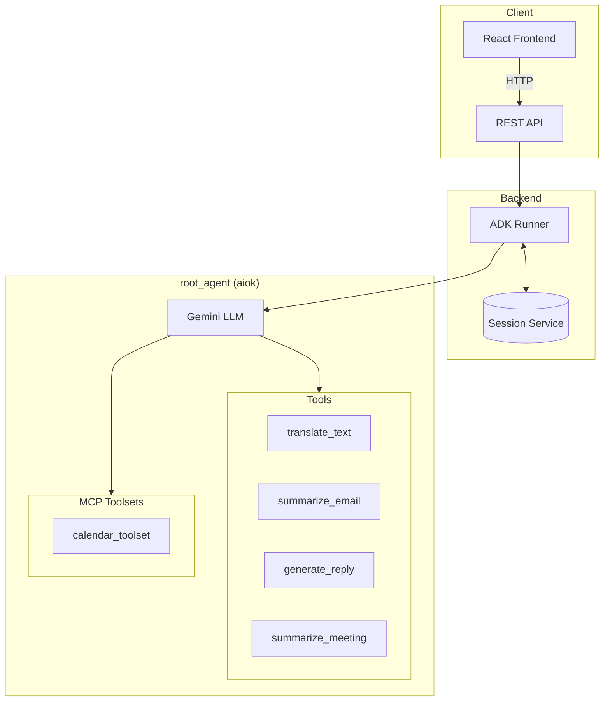
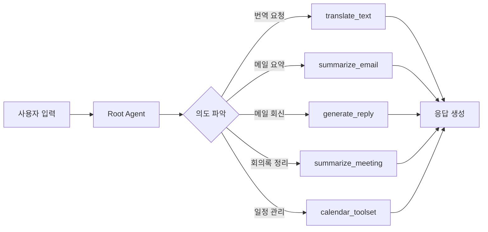

# AIOK - AI Orchestration for Work Automation

Google ADK 기반 업무자동화 AI Agent 시스템

## Key Features

- **번역 (Translation)**: 한/영/일/중 다국어 번역 (비즈니스/캐주얼/포멀 스타일)
- **이메일 처리 (Email)**: 메일 요약 및 회신 초안 생성
- **회의록 정리 (Meeting)**: 회의 요약 및 액션 아이템 추출
- **일정 관리 (Calendar)**: Google Calendar MCP 연동 (선택)
- **파일 첨부 (File Upload)**: PDF, Word, PPT 파일 파싱 지원

## Getting Started

### Setup

`.env.example`을 참고하여 `.env` 파일 생성:

```bash
cp .env.example .env
# GOOGLE_API_KEY 설정 (필수)
```

### 설치

```bash
uv sync
```

### 실행

```bash
# 백엔드 서버
uv run uvicorn main:app --reload --port 8000

# 프론트엔드 (별도 터미널)
cd ui && pnpm dev
```

## API Endpoints

| Method | Endpoint | Description |
|--------|----------|-------------|
| GET | `/health` | 헬스체크 |
| POST | `/api/v1/chat` | 채팅 메시지 전송 |
| GET | `/api/v1/sessions` | 세션 목록 조회 |
| GET | `/api/v1/sessions/{id}/messages` | 세션 히스토리 조회 |
| POST | `/api/v1/upload` | 파일 업로드 |

## Agent Architecture



### Tool Flow



## Project Structure

```
aiok/
├── main.py                 # FastAPI 앱 엔트리포인트
├── agent.py                # Root agent export
├── app/
│   ├── agent/
│   │   └── root.py         # 메인 에이전트 정의
│   ├── config/
│   │   └── settings.py     # 설정 (dataclass)
│   ├── mcp/
│   │   └── toolsets.py     # MCP toolset 정의
│   ├── prompt/
│   │   └── instructions.py # 프롬프트/지시사항
│   └── tool/
│       ├── translation.py  # 번역 도구
│       ├── email.py        # 이메일 도구
│       ├── meeting.py      # 회의 도구
│       └── file_parser.py  # 파일 파싱
└── ui/                     # React 프론트엔드
```

## Tech Stack

- **Runtime**: Python 3.11+
- **Agent Framework**: Google ADK (Agent Development Kit)
- **Web Framework**: FastAPI
- **Session Storage**: InMemorySessionService / PostgreSQL
- **Frontend**: React + Vite + TypeScript
- **Package Manager**: uv (Python), pnpm (Node.js)
