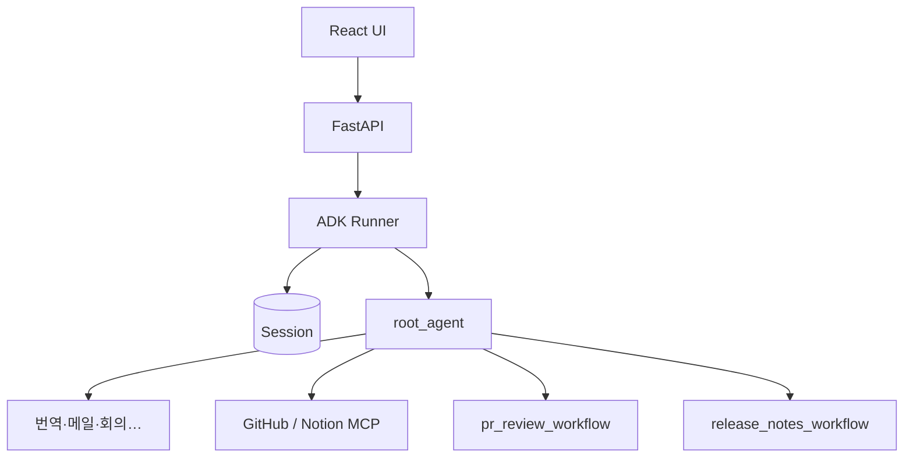

# AIOK

**Google ADK** 기반 업무 자동화 AI 에이전트 — 채팅으로 번역·메일·회의 처리와 **GitHub PR 리뷰·릴리즈 노트**까지 연결합니다.

| 문서 | 설명 |
|------|------|
| **[발표 자료](../docs/PRESENTATION.md)** | 아키텍처, 에이전트 역할, Mermaid 다이어그램, 실행 순서 |
| [저장소 루트 `docs/`](../docs/) | 개발 스펙, 로드맵, QA 등 |

---

## 주요 기능

### 루트 에이전트 (Supervisor)

| 구분 | 내용 |
|------|------|
| **일반 업무** | 번역, 메일 요약·회신 초안, 회의록 요약, (선택) Google Calendar MCP |
| **개발 업무** | **PR 리뷰** 워크플로우, **릴리즈 노트** 생성·번역·Notion·GitHub 게시 |
| **파일** | PDF / Word / PPT 업로드 후 텍스트 추출 |

### MCP 연동 (환경 변수로 켜기)

- **GitHub** — PR·이슈·커밋 조회 (리뷰·릴리즈)
- **Notion** — 릴리즈 노트 페이지 저장 (선택)
- **Calendar** — 일정 (선택)

---

## 빠른 시작

### 1. 환경 변수

```bash
cp .env.example .env
```

- **필수:** Google 인증 — **Vertex AI**(서비스 계정) 또는 **Gemini API 키** 중 하나 (`.env.example` 주석 참고)
- **선택:** `GITHUB_TOKEN`, `ENABLE_GITHUB_MCP`, `NOTION_TOKEN`, `ENABLE_NOTION_MCP`, `NOTION_PAGE_ID` 등
- **채팅 히스토리 DB 저장:** `DATABASE_URL` 설정 시 PostgreSQL 세션 사용 (미설정 시 인메모리, 재시작 시 초기화)

### 2. 설치

```bash
uv sync
```

### 3. 실행

```bash
# 백엔드 (aiok 디렉터리 기준)
uv run uvicorn main:app --reload --port 8000

# 프론트엔드 (별도 터미널)
cd ui && pnpm install && pnpm dev
```

- API: `http://127.0.0.1:8000`
- 헬스: `GET /health`

---

## API 엔드포인트

| Method | Path | 설명 |
|--------|------|------|
| GET | `/health` | 헬스체크 |
| POST | `/api/v1/chat` | 채팅 (선택: `session_id`, `user_id`, `file_ids`) |
| GET | `/api/v1/sessions` | 세션 목록 |
| GET | `/api/v1/sessions/{id}/messages` | 세션 메시지 히스토리 |
| POST | `/api/v1/upload` | 파일 업로드 |

---

## 에이전트 구조 (요약)

- **`root_agent`** — 의도 분기: 도구 직접 호출 vs `pr_review_workflow` vs `release_notes_workflow`
- **`pr_review_workflow`** — Sequential: PR 수집 → 분석 → 리뷰 포인트
- **`release_notes_workflow`** — Sequential: PR/이슈/커밋 수집 → 분류 → KO 작성 → EN 번역 → Notion → GitHub Release 등

상세 다이어그램은 **[`docs/PRESENTATION.md`](../docs/PRESENTATION.md)** 참고.

### 전체 흐름 (Mermaid)



---

## 프로젝트 구조

```
aiok/
├── main.py                    # FastAPI + ADK Runner
├── agent.py                   # root_agent 재export (외부 연동용)
├── app/
│   ├── agent/
│   │   ├── root.py            # Supervisor 루트 에이전트
│   │   ├── sub_agents.py      # LlmAgent 팩토리
│   │   └── workflows.py       # Sequential 워크플로우
│   ├── config/settings.py
│   ├── mcp/toolsets.py        # GitHub / Notion / Calendar MCP
│   ├── prompt/instructions.py
│   └── tool/                  # 번역, 메일, 회의, 릴리즈 게시 등
└── ui/                        # React + Vite
```

---

## 기술 스택

| 항목 | 사용 |
|------|------|
| **언어** | Python 3.11+ |
| **에이전트** | Google ADK (`Agent`, `SequentialAgent`, `LlmAgent`, `Runner`, MCP `MCPToolset`) |
| **API** | FastAPI |
| **세션** | `InMemorySessionService` 또는 `DatabaseSessionService` (PostgreSQL) |
| **프론트** | React, Vite, TypeScript |
| **패키지** | `uv` (Python), `pnpm` (Node) |

---

## 라이선스

MIT (프로젝트 설정 기준)
