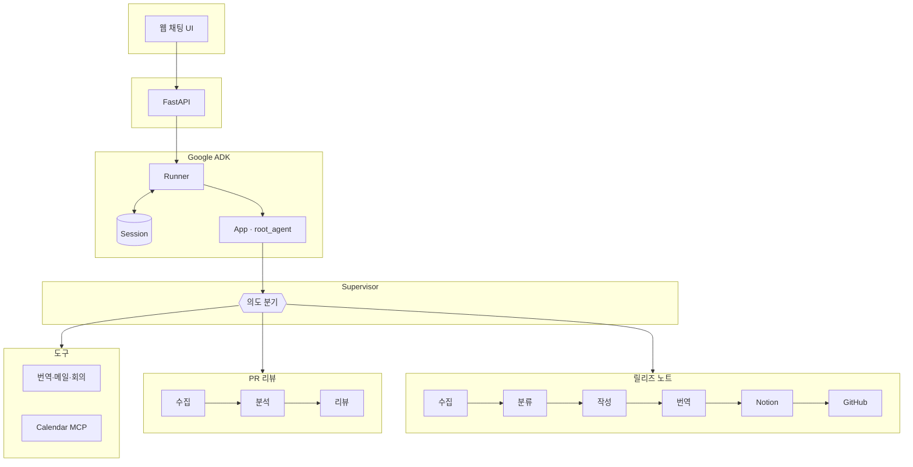
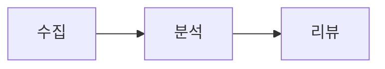
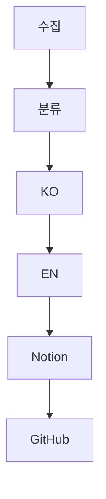

<div align="center">

# AIOK

### 업무 자동화를 위한 AI 에이전트 시스템

Google **ADK**(Agent Development Kit) 교육에서 배운  
**Supervisor · 멀티 에이전트 · MCP · 세션**을 하나의 서비스로 구현했습니다.

<br/>

**한 줄 요약**  
*채팅 한 번으로 번역·메일·회의 처리 + GitHub PR 리뷰·릴리즈 노트까지 자동화*

<br/>

---

[아키텍처](#1-시스템-구조) · [에이전트 역할](#2-에이전트-역할) · [다이어그램](#3-구성도-mermaid) · [ADK 구성요소](#4-adk에서-사용한-것) · [특징·한계](#5-특징--한계) · [실행 방법](#6-실행-방법)

---

</div>

<br/>

## 발표 흐름 (추천 순서)

| 순서 | 내용 | 시간 감각 |
|:---:|:---|:---:|
| 1 | 데모: 채팅으로 "번역" 또는 "릴리즈 노트" 요청 | 2~3분 |
| 2 | 왜 ADK인지 → Supervisor + 워크플로우 | 1~2분 |
| 3 | 구성도(Mermaid)로 전체 구조 한 장 | 1~2분 |
| 4 | MCP로 GitHub·Notion 연동 | 1분 |
| 5 | 실행 방법 + Q&A | 1~2분 |

---

## 1. 시스템 구조

### 청중이 기억할 그림 (한 장)

```
┌─────────────┐     HTTP      ┌─────────────┐     ADK      ┌──────────────────┐
│  웹 채팅 UI  │ ────────────► │   FastAPI   │ ───────────► │  Runner + Session │
│ (React/Vite)│               │ /api/v1/chat│              │                   │
└─────────────┘               └─────────────┘              └─────────┬─────────┘
                                                                     │
                                     ┌──────────────────────────────┴──────────────────────────────┐
                                     ▼                                                             ▼
                          ┌─────────────────────┐                                   ┌─────────────────────┐
                          │  직접 도구 (번역 등)  │                                   │ 서브 워크플로우      │
                          │  + (선택) Calendar MCP│                                   │ PR 리뷰 / 릴리즈 노트 │
                          └─────────────────────┘                                   └─────────────────────┘
```

### 구성 요소 (짧게)

| 층 | 기술 | 역할 |
|:---|:---|:---|
| UI | React + Vite | 세션·채팅·파일 첨부 |
| API | FastAPI | 채팅 요청을 ADK `Runner`에 전달 |
| AI | Gemini (Vertex AI 또는 API 키) | 추론·도구 선택·서브 에이전트 실행 |
| 세션 | 메모리 또는 PostgreSQL | 대화 맥락 유지 (`DATABASE_URL` 선택) |

---

## 2. 에이전트 역할

### 루트 에이전트 `aiok` — Supervisor

사용자 말의 **의도**를 보고 아래로 나눕니다.

| 분기 | 처리 방식 |
|:---|:---|
| 번역 · 메일 · 회의 | **내장 도구**로 즉시 처리 |
| PR 리뷰 | **`pr_review_workflow`** 로 위임 |
| 릴리즈 노트 | **`release_notes_workflow`** 로 위임 |

---

### 워크플로우 A — `pr_review_workflow` (순차 3단계)

```
PR 정보 수집  →  코드/영향 분석  →  리뷰 코멘트·체크리스트 작성
   (GitHub MCP)        (LLM)                  (LLM)
```

---

### 워크플로우 B — `release_notes_workflow` (수집 → 작성 → 배포)

| 단계 | 하는 일 |
|:---:|:---|
| ① 수집 | 머지 PR · 이슈 · 커밋 (순차, API 부담 완화) |
| ② 분류 | 기능 / 수정 / 브레이킹 등으로 정리 |
| ③ 작성 | 한국어 릴리즈 노트 |
| ④ 번역 | 영어 버전 |
| ⑤ 저장 | Notion (MCP + 저장 도구) |
| ⑥ 게시 | GitHub Release · CHANGELOG 등 |

---

## 3. 구성도 (Mermaid)

> GitHub / Notion / VS Code 등에서 Mermaid 미리보기가 되면 그대로 슬라이드에 넣을 수 있습니다.

### 전체



### PR 리뷰만



### 릴리즈 노트만



---

## 4. ADK에서 사용한 것

| 구분 | 모듈 / 개념 |
|:---|:---|
| 앱 | `App` + 루트 `Agent` |
| 실행 | `Runner`, `run_async` |
| 세션 | `InMemorySessionService` / `DatabaseSessionService` |
| 워크플로우 | `SequentialAgent` — 단계별 파이프라인 |
| 단계 에이전트 | `LlmAgent` — 수집·분석·작성 등 |
| 확장 | `MCPToolset` — GitHub, Notion, (선택) Calendar |
| 메시지 | `google.genai.types` |


---

## 5. 특징 · 한계


## 6. 실행 방법

### 1) 환경 파일

```bash
cd aiok
cp .env.example .env
```

`.env`에서 **Google 인증**(Vertex 또는 API 키), 필요 시 **GITHUB_TOKEN**, **NOTION_TOKEN** 등을 설정합니다.

### 2) 백엔드

```bash
uv sync
uv run uvicorn main:app --reload --port 8000
```

- 채팅 API: `POST /api/v1/chat`  
- 헬스: `GET /health`

### 3) 프론트엔드 (별도 터미널)

```bash
cd ui
pnpm install
pnpm dev
```

브라우저에서 표시되는 로컬 주소(예: `http://localhost:5173`)로 접속합니다.

---
